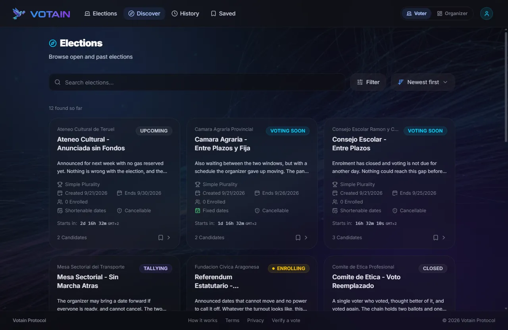
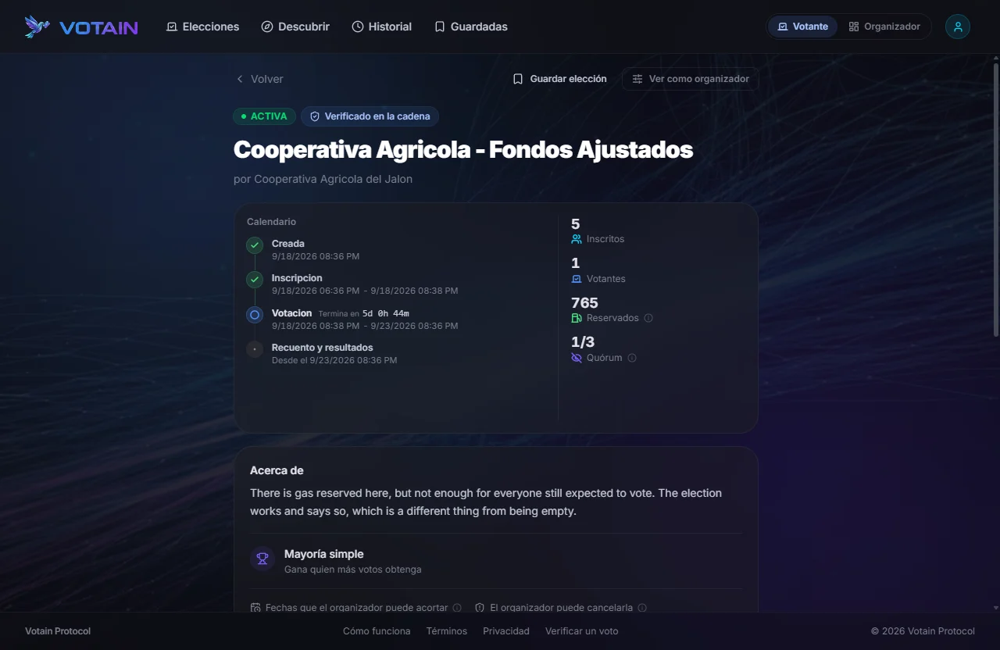
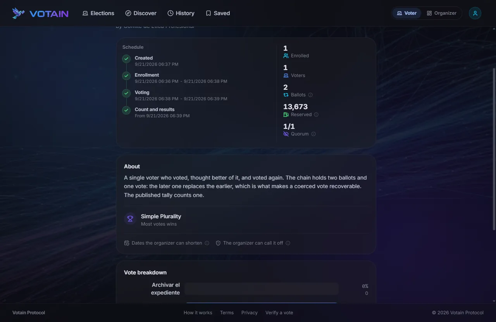
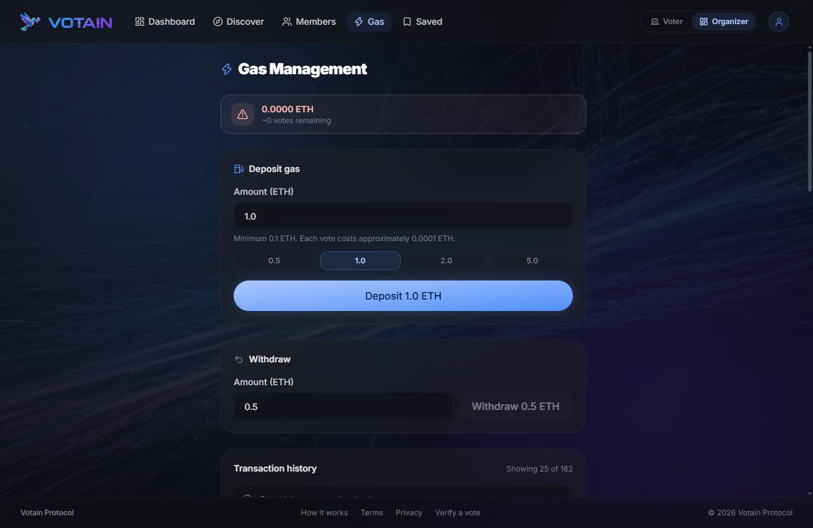
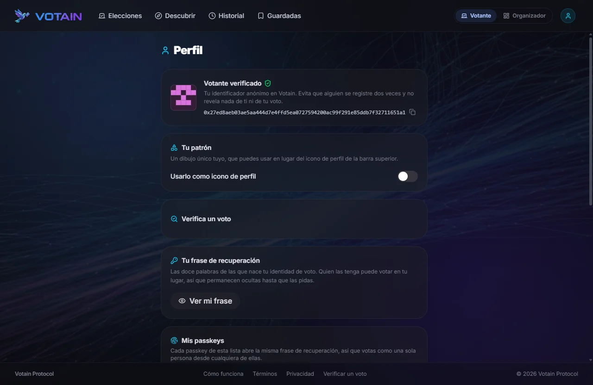
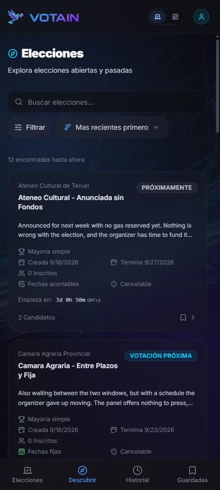
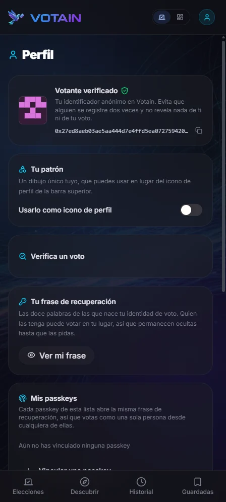
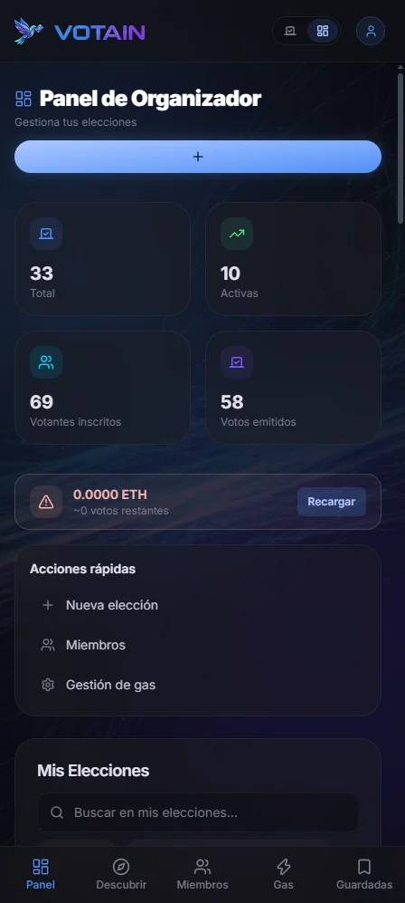

# Votain

> End-to-end verifiable, anonymous, coercion-resistant voting dApp on Polygon Amoy.

Votain is a Bachelor's thesis project (TFG) demonstrating how modern cryptographic primitives (Zero-Knowledge Proofs, Verifiable Credentials, Homomorphic Encryption and meta-transaction relaying) can be combined into a voting system where every voter can verify their ballot is counted, no one can be coerced, and no central authority can tamper with results.

## Why Votain

| Property | How it is achieved |
|----------|--------------------|
| **End-to-end verifiable** | Every vote is a Paillier ciphertext stored on-chain, so anyone can re-run the homomorphic sum from the chain itself. The auditor CLI additionally pins a result JSON to IPFS and publishes its CID; the in-app tally does not pin yet |
| **Anonymous** | Semaphore V4 zero-knowledge proofs hide voter identity inside the eligible-voters group |
| **Coercion resistant** | Per-nullifier nonce lets a coerced voter silently override a prior ballot. Only the highest-nonce vote counts |
| **Sybil resistant** | World ID v4 proof of personhood, bound to a per-election scope |
| **Eligible without identifying** | Age and nationality come from the chip in a passport or national identity card, read over NFC by the [Self](https://self.xyz) app and proved in zero knowledge. The document never leaves the phone, and age is asked as a predicate: the answer is "over 18", never a date of birth |
| **Gasless for voters** | Ballots are relayed through `ElectionPaymaster`, reimbursed from the organizer's own gas tank; voters never hold tokens |
| **Unlinkable on chain** | Every voter's call arrives from the same relay contract, so the sender address cannot tie an enrollment to a ballot |
| **Decentralized deployment** | Frontend on IPFS (Fleek), issuer in Intel TDX TEE (Phala), contracts on Polygon Amoy |

## Screenshots

<p align="center">
  
</p>

<table>
  <tr>
    <td width="50%"></td>
    <td width="50%"></td>
  </tr>
  <tr>
    <td>An election, with its phases dated and the quorum it has to clear.</td>
    <td>Results, once the homomorphic sum has been decrypted and written back.</td>
  </tr>
  <tr>
    <td></td>
    <td></td>
  </tr>
  <tr>
    <td>The gas tank voters spend from, priced from past relays rather than assumed.</td>
    <td>The voter's profile: their identifier, recovery phrase and passkeys.</td>
  </tr>
</table>

<p align="center">
  
  &nbsp;
  
  &nbsp;
  
</p>

**[Every screen, desktop and mobile →](docs/SCREENS.md)**

<p align="center"><em>Built for a phone first. 13 languages, including right-to-left Arabic.</em></p>

> Captured against a local Hardhat node with the contracts deployed on it: real elections,
> real enrolments, real ballots. Nothing is on Polygon Amoy yet, so none of it has faced a
> public chain. The app also ships a demo dataset for when no contracts are configured, and
> says so in a banner on every screen while it is in use.

## Architecture overview

```
User (recovery phrase + World ID)
    ├── React 19 + Vite + Tailwind 4             ◄──── IPFS (Fleek)
    │
    ├── SD-JWT issuance ── Backend (Node + Express)  ◄──── Phala TEE
    │                      Verifies World ID (personhood) and
    │                      Self proofs (age, nationality), issues VC
    │
    └── relayed tx ─────── Polygon Amoy
                           ElectionFactory · ElectionV4
                           ElectionPaymaster · PlatformRegistry
                           Semaphore V4 Verifier
                                                  │
                                                  ▼
                           Tally (Paillier homomorphic sum): in-app in the
                           browser, or the off-chain CLI (auditor path)
                           → Result JSON pinned on IPFS (Pinata, CLI)
                           → publishResults(cid, tally) on-chain
```

Full diagram in [`docs/dev/architecture.md`](docs/dev/architecture.md).

## Monorepo layout

```
votain/
├── contracts/         # Solidity 0.8.37 + Hardhat 3 + Semaphore V4
├── backend/           # Node.js Express SD-JWT issuer (target: Phala TEE)
├── frontend/          # React 19 + Vite (target: IPFS / Fleek)
├── scripts-tally/     # off-chain Paillier tally + IPFS publication (auditor CLI)
├── docs/
│   ├── PLAN.md        # iterative milestone plan (source of truth)
│   ├── dev/           # developer documentation
│   │   ├── architecture.md
│   │   ├── conventions.md
│   │   ├── glossary.md
│   │   └── state.md   # current milestone, versions, technical debt
│   └── screenshots/   # the images this README shows
└── memoria/           # LaTeX thesis (parallel track)
```

## Tech stack

**Contracts**: Solidity 0.8.37, Hardhat 3, ethers v6, OpenZeppelin 5, [`@semaphore-protocol/contracts`](https://semaphore.pse.dev/) 4.x, ERC-2771 context.

**Backend**: Node.js 24, Express 5, [`@sd-jwt/core`](https://github.com/openwallet-foundation-labs/sd-jwt-js) (EdDSA / Ed25519), [`@worldcoin/idkit-core`](https://docs.world.org/) v4, [`@selfxyz/core`](https://self.xyz) for document-backed eligibility, tsx.

**Two identity sources, two different jobs.** World ID answers *are you a distinct human*, once per election scope. Self answers *do you meet this election's rules* (a minimum age, a nationality inside or outside a named set) from a real document, without disclosing the values behind the answers. Only `backend/src/eligibility/self.ts` knows Self exists: the rest of `eligibility/` speaks in policies and attestations, so an EUDI Wallet connector can be added beside it without touching them.

**Frontend**: React 19, Vite (Rolldown), Tailwind CSS 4, [`@semaphore-protocol/{identity,group,proof}`](https://semaphore.pse.dev/), [`paillier-bigint`](https://github.com/juanelas/paillier-bigint), [`@worldcoin/idkit`](https://docs.world.org/), i18next (13 languages), framer-motion.

Pinned versions live in [`docs/dev/state.md`](docs/dev/state.md).

## Quick start

```bash
# Contracts (185 tests, Hardhat 3)
cd contracts
npm install
npx hardhat test
npx hardhat compile

# Backend (requires .env with ISSUER_PRIVATE_KEY, see backend/.env.example)
cd backend
npm install
npm test                             # 126 tests, node:test
npm run dev                          # http://localhost:3000

# Frontend
cd frontend
npm install
npm test                             # 501 tests, vitest
npm run dev                          # http://localhost:5173
npm run build
```

> **Windows / corporate network**: prepend `NODE_OPTIONS="--use-system-ca"` to any `npm install` or `npm-check-updates` command to avoid SSL chain errors.

## Project status

Contracts, backend issuer and both user flows are written, wired together and green.
What is NOT done is the last mile: nothing is deployed to Amoy yet, so none of it has
been exercised against a live chain, and the IPFS audit trail is produced only by the
auditor CLI. See [`docs/PLAN.md`](docs/PLAN.md) for the plan and
[`docs/dev/state.md`](docs/dev/state.md) for what is pinned and what is owed.

| Milestone | Description | Status |
|-----------|-------------|--------|
| H0 | Bootstrap, dependency upgrade, dev docs | ✅ |
| H1 | Design system and base components | ✅ |
| H2 to H4 | 24 screens, 13 languages | ✅ |
| H5 | Production contracts + chain client | ✅ code complete, Amoy deploy pending |
| H6 | Backend issuer feature complete | ✅ |
| H7, H8 | Real voter and organizer integration | ✅ |
| H9 | Tally + IPFS results | 🟡 tally done in-app and in the CLI; IPFS pinning only in the CLI |
| H10 | Frontend on IPFS (Fleek) | ⏳ |
| H11 | Backend on Phala TEE | ⏳ |
| H12, H13 | Thesis and defense | ⏳ |

**812 tests pass**: 185 on the contracts, 126 on the backend, 501 on the frontend.

## Documentation

- [`CONTRIBUTING.md`](CONTRIBUTING.md). Developer guide, monorepo conventions.
- [`docs/PLAN.md`](docs/PLAN.md). Milestone plan and operating rules.
- [`docs/SCREENS.md`](docs/SCREENS.md). Every screen, desktop and mobile, both roles.
- [`docs/dev/architecture.md`](docs/dev/architecture.md). Full system architecture.
- [`docs/dev/conventions.md`](docs/dev/conventions.md). Coding conventions, color tokens, i18n keys.
- [`docs/dev/glossary.md`](docs/dev/glossary.md). Semaphore, nullifier, SD-JWT, relaying, Paillier, TEE.
- [`docs/dev/state.md`](docs/dev/state.md). Current state, pinned versions, technical debt.
- Per-module guides: [`contracts/DEVELOPMENT.md`](contracts/DEVELOPMENT.md), [`backend/DEVELOPMENT.md`](backend/DEVELOPMENT.md), [`frontend/DEVELOPMENT.md`](frontend/DEVELOPMENT.md).

## License

Votain is released under the **GNU Affero General Public License v3.0 (AGPL-3.0)**. See [`LICENSE`](LICENSE) for the full text.

This means you are free to use, modify and redistribute Votain, but if you run a modified version as a network-accessible service you must publish your source. **Commercial licenses without AGPL obligations are available**. Contact the author.

## Author

Sergio Barrios Paz. Bachelor's thesis (TFG), Universidad Rey Juan Carlos (ETSII), 2026.
