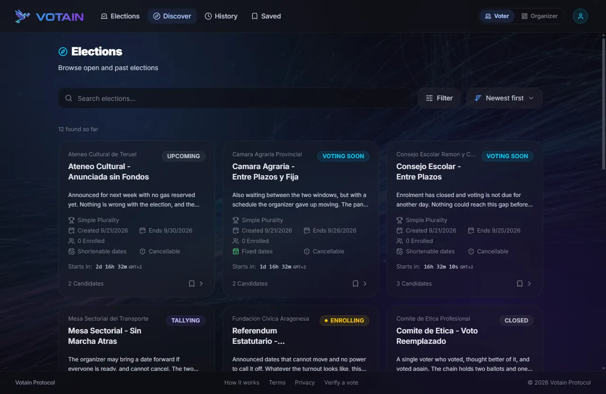
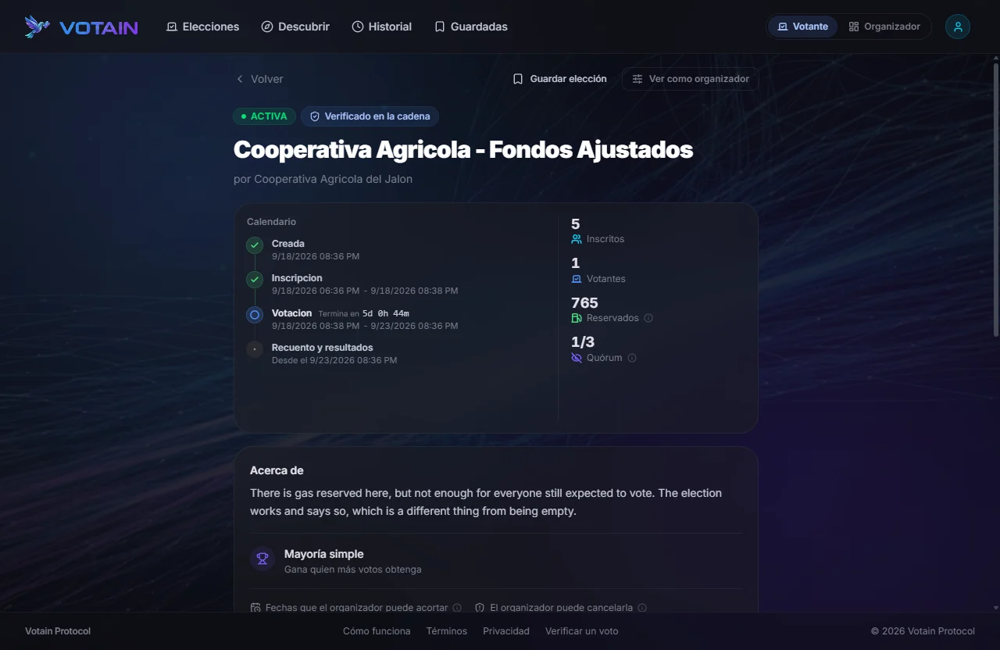
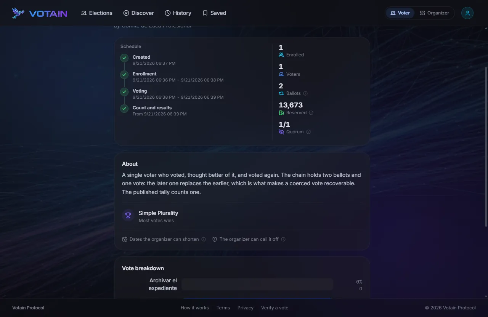
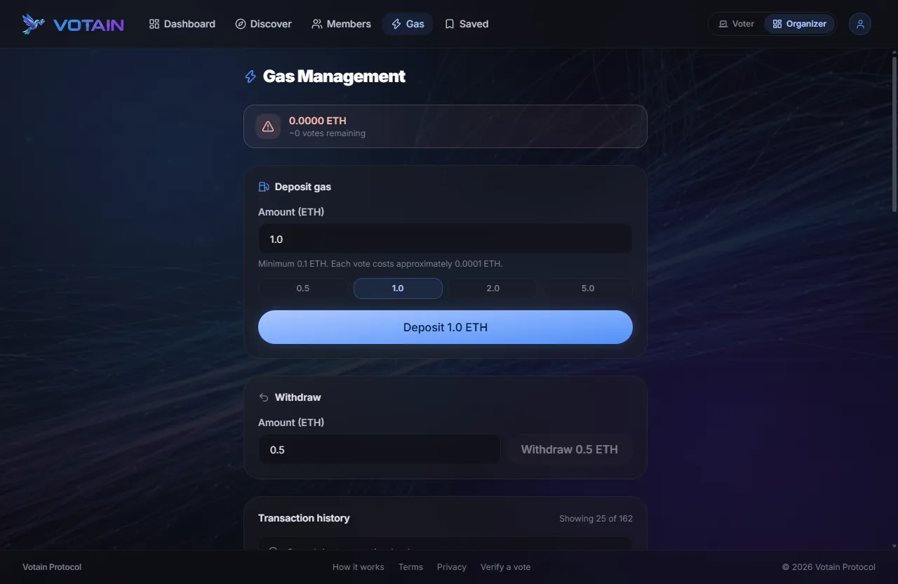
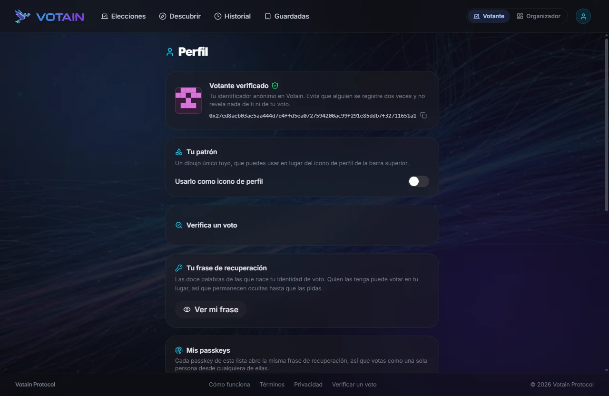
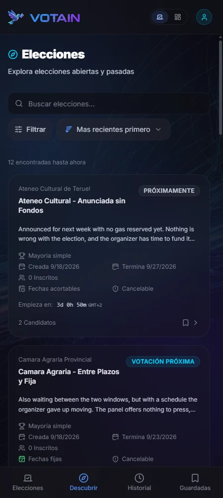
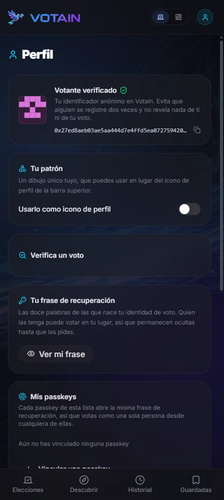
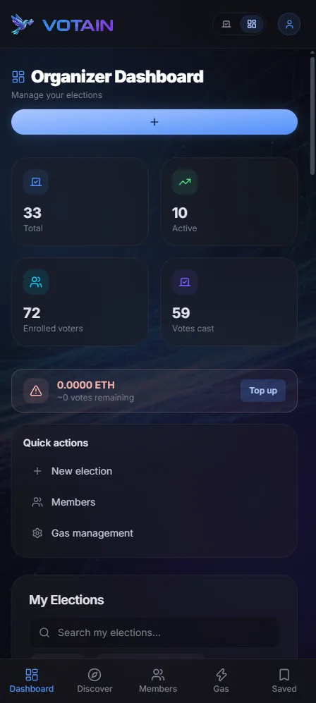
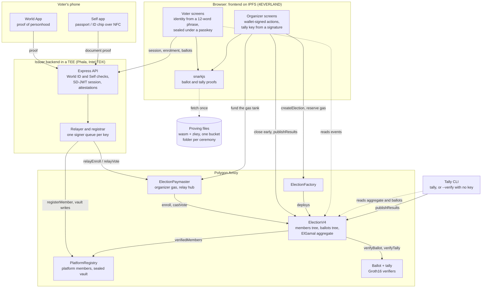
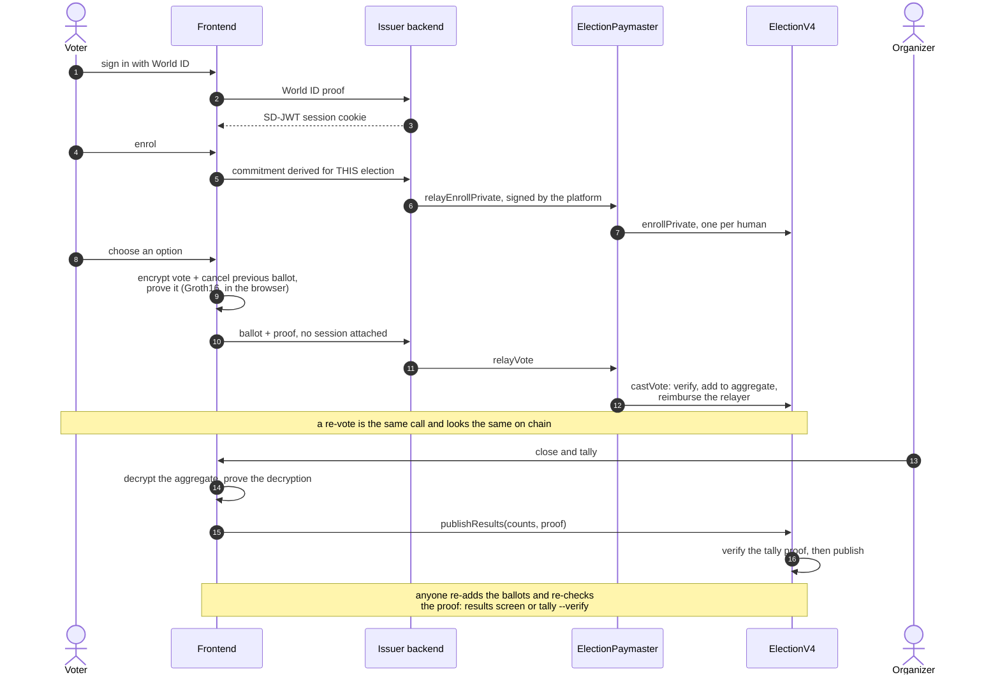

# Votain

> End-to-end verifiable, anonymous, coercion-resistant voting dApp on Polygon Amoy.

Votain is a Bachelor's thesis project (TFG) demonstrating how modern cryptographic primitives (Zero-Knowledge Proofs, Verifiable Credentials, Homomorphic Encryption and meta-transaction relaying) can be combined into a voting system where every voter can verify their ballot is counted, a coerced ballot can always be overridden, and no organizer can publish a result the ballots do not support.

## Why Votain

| Property | How it is achieved |
|----------|--------------------|
| **End-to-end verifiable** | Every ballot is an ElGamal ciphertext on chain with a zero-knowledge proof that it is exactly one valid option, so a stuffed or malformed ballot never gets in. The election adds every ballot into an aggregate itself, and publishes a result only with a proof that the counts are that aggregate's decryption. Anyone can re-add the ballots and re-check the proof with no key, in the results screen or with `npm run tally -- <election> --verify`. Nothing else has to be trusted or stored: the ballots and the verified proof are on chain. The auditor CLI can also pin a result JSON to IPFS, as a readable copy; the app does not, because it adds no evidence the chain lacks |
| **Anonymous** | Each ballot carries a zero-knowledge proof that its voter is on the election's roll, over Semaphore V4 identities and a per-election tree, without saying which member cast it |
| **Coercion resistant** | A coerced voter can vote again, and nobody watching can tell they did. Every ballot silently cancels the voter's previous one, proved in zero knowledge without saying which, and a first vote and a re-vote look the same on chain. At most two ballots per voter within an hour (one straight away, then one an hour) bound how fast anyone can spend the organizer's gas, through tags that link nothing. The limit, stated plainly: the organizer's key could open a single ballot and see that it replaced one, though never whose it is (see [Known limits](#known-limits)) |
| **Sybil resistant** | World ID v4 proof of personhood under one action fixed by the server, so one person holds one platform identity. Elections that require a document also refuse the same passport or ID card twice, whatever World ID account it arrives with |
| **Eligible without identifying** | Age and nationality come from the chip in a passport or national identity card, read over NFC by the [Self](https://self.xyz) app and proved in zero knowledge. The document never leaves the phone, and age is asked as a predicate: the answer is "over 18", never a date of birth |
| **Gasless for voters** | Ballots are relayed through `ElectionPaymaster`, reimbursed from the organizer's own gas tank; voters never hold tokens |
| **Unlinkable on chain** | Every voter's call arrives from the same relay contract, so the sender address cannot tie an enrollment to a ballot |
| **Decentralized deployment** | Frontend on IPFS (4EVERLAND) at `votain.app`, issuer in an Intel TDX enclave (Phala) at `api.votain.app` with its image built in public CI and pinned by digest, contracts on Polygon Amoy |

## Screenshots

<p align="center">
  
</p>

<table>
  <tr>
    <td width="50%"></td>
    <td width="50%"></td>
  </tr>
  <tr>
    <td>An election, with its phases dated and the quorum it has to clear.</td>
    <td>Results, once the homomorphic sum has been decrypted and written back.</td>
  </tr>
  <tr>
    <td></td>
    <td></td>
  </tr>
  <tr>
    <td>The gas tank voters spend from, priced from past relays rather than assumed.</td>
    <td>The voter's profile: their identifier, recovery phrase and passkeys.</td>
  </tr>
</table>

<p align="center">
  
  &nbsp;
  
  &nbsp;
  
</p>

**[Every screen, desktop and mobile →](docs/SCREENS.md)**

<p align="center"><em>Built for a phone first. 13 languages, including right-to-left Arabic.</em></p>

> Captured against a local Hardhat node with the contracts deployed on it: real elections,
> real enrolments, real ballots. Nothing is on Polygon Amoy yet, so none of it has faced a
> public chain. The app also ships a demo dataset for when no contracts are configured, and
> says so in a banner on every screen while it is in use.

## Architecture overview

Who talks to whom. Voters and organizers only ever run the frontend; the
issuer vouches for people and relays their calls; the contracts hold the
ballots and decide what counts.


```mermaid
flowchart TB
  subgraph phone["Voter's phone"]
    worldapp["World App<br/>proof of personhood"]
    selfapp["Self app<br/>passport / ID chip over NFC"]
  end

  subgraph browser["Browser: frontend on IPFS (4EVERLAND)"]
    voter["Voter screens<br/>identity from a 12-word phrase,<br/>sealed under a passkey"]
    organizer["Organizer screens<br/>wallet-signed actions,<br/>tally key from a signature"]
    prover["snarkjs<br/>ballot and tally proofs"]
  end

  circuitfiles[("Proving files<br/>wasm + zkey, one bucket<br/>folder per ceremony")]

  subgraph tee["Issuer backend in a TEE (Phala, Intel TDX)"]
    api["Express API<br/>World ID and Self checks,<br/>SD-JWT session, attestations"]
    relayer["Relayer and registrar<br/>one signer queue per key"]
  end

  subgraph chain["Polygon Amoy"]
    factory["ElectionFactory"]
    election["ElectionV4<br/>members tree, ballots tree,<br/>ElGamal aggregate"]
    paymaster["ElectionPaymaster<br/>organizer gas, relay hub"]
    registry["PlatformRegistry<br/>platform members, sealed vault"]
    verifiers["Ballot + tally<br/>Groth16 verifiers"]
  end

  cli["Tally CLI<br/>tally, or --verify with no key"]

  worldapp -- "proof" --> api
  selfapp -- "document proof" --> api
  voter -- "session, enrolment, ballots" --> api
  voter --> prover
  organizer --> prover
  prover -. "fetch once" .-> circuitfiles
  api --> relayer
  relayer -- "registerMember, vault writes" --> registry
  relayer -- "relayEnroll / relayVote" --> paymaster
  paymaster -- "enroll, castVote" --> election
  organizer -- "createElection, reserve gas" --> factory
  organizer -- "close early, publishResults" --> election
  organizer -- "fund the gas tank" --> paymaster
  factory -- "deploys" --> election
  election -- "verifyBallot, verifyTally" --> verifiers
  election -- "verifiedMembers" --> registry
  voter -. "reads events" .-> election
  cli -. "reads aggregate and ballots" .-> election
  cli -- "publishResults" --> election
```

A vote, end to end. Every ballot is a vote plus the cancellation of the voter's
previous one, so the aggregate the contract keeps always decrypts to each
voter's LAST vote, and nothing public says which ballots are re-votes.


```mermaid
sequenceDiagram
  autonumber
  actor V as Voter
  participant F as Frontend
  participant B as Issuer backend
  participant P as ElectionPaymaster
  participant E as ElectionV4
  actor O as Organizer

  V->>F: sign in with World ID
  F->>B: World ID proof
  B-->>F: SD-JWT session cookie
  V->>F: enrol
  F->>B: commitment derived for THIS election
  B->>P: relayEnrollPrivate, signed by the platform
  P->>E: enrollPrivate, one per human
  V->>F: choose an option
  F->>F: encrypt vote + cancel previous ballot,<br/>prove it (Groth16, in the browser)
  F->>B: ballot + proof, no session attached
  B->>P: relayVote
  P->>E: castVote: verify, add to aggregate,<br/>reimburse the relayer
  Note over V,E: a re-vote is the same call and looks the same on chain
  O->>F: close and tally
  F->>F: decrypt the aggregate, prove the decryption
  F->>E: publishResults(counts, proof)
  E->>E: verify the tally proof, then publish
  Note over F,E: anyone re-adds the ballots and re-checks<br/>the proof: results screen or tally --verify
```

The full design, with its threat model and known limits, is in
[`docs/dev/architecture.md`](docs/dev/architecture.md).

## Monorepo layout

```
votain/
├── circuits/          # ballot + tally circuits (circom), trusted setup, verifier generation
├── contracts/         # Solidity 0.8.37 + Hardhat 3
├── backend/           # Node.js Express SD-JWT issuer (target: Phala TEE)
├── frontend/          # React 19 + Vite (deployed: IPFS / 4EVERLAND)
├── scripts-tally/     # off-chain tally, proof, IPFS publication and --verify (auditor CLI)
└── docs/
    ├── PLAN.md        # iterative milestone plan (source of truth)
    ├── dev/           # developer documentation
    │   ├── architecture.md
    │   ├── conventions.md
    │   ├── glossary.md
    │   └── state.md   # current milestone, versions, technical debt
    └── screenshots/   # the images this README shows
```

The LaTeX thesis lives in a separate private repository.

## Tech stack

**Circuits**: circom 2 (WASM build), circomlib, Groth16 via [`snarkjs`](https://github.com/iden3/snarkjs); Semaphore V4 identities and LeanIMT trees.

**Contracts**: Solidity 0.8.37, Hardhat 3, ethers v6, OpenZeppelin 5, LeanIMT and Poseidon from [zk-kit](https://github.com/privacy-scaling-explorations/zk-kit).

**Backend**: Node.js 24, Express 5, [`@sd-jwt/core`](https://github.com/openwallet-foundation-labs/sd-jwt-js) (EdDSA / Ed25519), [`@worldcoin/idkit-core`](https://docs.world.org/) v4, [`@selfxyz/core`](https://self.xyz) for document-backed eligibility, tsx.

**Two identity sources, two different jobs.** World ID answers *are you a distinct human*, once per election scope. Self answers *do you meet this election's rules* (a minimum age, a nationality inside or outside a named set) from a real document, without disclosing the values behind the answers. Only `backend/src/eligibility/self.ts` knows Self exists: the rest of `eligibility/` speaks in policies and attestations, so an EUDI Wallet connector can be added beside it without touching them.

**Frontend**: React 19, Vite (Rolldown), Tailwind CSS 4, [`@semaphore-protocol/{identity,group}`](https://semaphore.pse.dev/), `snarkjs` (proving in the browser), [`@worldcoin/idkit`](https://docs.world.org/), i18next (13 languages), framer-motion.

Pinned versions live in [`docs/dev/state.md`](docs/dev/state.md).

## Quick start

```bash
# Circuits: witness tests, then the trusted setup and the generated verifiers.
# The first build spends ~15 minutes on a local phase 1 (cached afterwards);
# PTAU=<path to a public powers-of-tau file> skips it.
cd circuits
npm install
npm test
npm run build

# Contracts (Hardhat 3; the E2E suite proves for real, so build circuits first)
cd contracts
npm install
npx hardhat test
npx hardhat compile

# Backend (requires .env with ISSUER_PRIVATE_KEY, see backend/.env.example)
cd backend
npm install
npm test                             # 167 tests, node:test
npm run dev                          # http://localhost:3000

# Frontend
cd frontend
npm install
npm test                             # 602 tests, vitest
npm run dev                          # http://localhost:5173
npm run build
```

> **Windows / corporate network**: prepend `NODE_OPTIONS="--use-system-ca"` to any `npm install` or `npm-check-updates` command to avoid SSL chain errors.

> **Windows / circuits**: circom2, the WebAssembly compiler `npm install` brings, cannot compile these circuits on Windows. Download the native `circom-windows-amd64.exe` (v2.2.3, the same version) from the [circom releases](https://github.com/iden3/circom/releases) and put it on the PATH as `circom`, or set `CIRCOM` to its path. It builds byte-identical artefacts. WSL works too.

## Project status

Contracts, backend issuer and both user flows are written, wired together and green,
and deployed: the contracts on Polygon Amoy since 2026-09-28 (verified on Polygonscan),
the frontend at `votain.app` and the issuer at `api.votain.app`. See [`docs/PLAN.md`](docs/PLAN.md) for the plan and
[`docs/dev/state.md`](docs/dev/state.md) for what is pinned and what is owed.

| Milestone | Description | Status |
|-----------|-------------|--------|
| H0 | Bootstrap, dependency upgrade, dev docs | ✅ |
| H1 | Design system and base components | ✅ |
| H2 to H4 | 24 screens, 13 languages | ✅ |
| H5 | Production contracts + chain client | ✅ on Polygon Amoy since 2026-09-28, verified on Polygonscan |
| H6 | Backend issuer feature complete | ✅ |
| H7, H8 | Real voter and organizer integration | ✅ |
| H9 | Tally + results | ✅ proved and verified on chain, in-app and from the CLI. IPFS pinning is optional and CLI only: the chain already holds the ballots and the proof |
| H10 | Frontend on IPFS (4EVERLAND) | ✅ live at `votain.app` |
| H11 | Backend in a TEE | ✅ verified on Phala (Intel TDX): image pinned by digest, signed provenance, attestation reports that digest. Served from Heroku between sessions, since Phala is $42/month; one workflow switches either way |
| H12, H13 | Thesis and defense | ⏳ |

**1008 tests pass**: 17 on the circuits, 222 on the contracts (the end-to-end suite with real Groth16 proofs), 167 on the backend, 602 on the frontend. The Playwright smoke suite renders every screen on desktop, tablet and phone (72).

## Known limits

Stated here so that nobody reads their absence as a guarantee; the full list is
in [`docs/dev/architecture.md`](docs/dev/architecture.md#known-limits-stated-plainly).

- **The organizer's key could open a single ballot.** The app only ever decrypts
  the aggregate, but the keys could open any one ballot, and its cancellation
  shows whether it replaced an earlier vote. Never whose ballot it is, nor which
  it replaced. Splitting the key among trustees (threshold decryption) would
  remove the power; on ElGamal that is now a protocol to add, not a primitive to
  change.
- **Two votes forced in a row in the last hour stand.** One voter can cast at
  most two ballots within an hour, the limit that keeps them from draining the
  organizer's gas without linking their ballots. A vote forced on a voter can
  always be replaced once, straight away; two forced in a row after the last
  hour boundary before voting closes cannot be.
- **The trusted setup is the deployment's to run.** The default circuit build
  uses a public development ceremony, which `deploy.ts` refuses off the local
  chain.
- **One backend instance, no indexer.** Rate limits and sessions live in process
  memory, and browsers read events straight from the RPC in windows. Fine at
  thesis scale; a public platform needs a shared store and an indexer.
- **The issuer sees network metadata** of the requests it relays.
- **Nothing makes the organizer tally.** There is no publishing deadline, so an
  organizer who never decrypts leaves the election without a result.

Threshold decryption, an auto-tally, a tally deadline and taking the per-user
gas off the platform are designed but left for after the thesis: see [Future work](docs/dev/architecture.md#future-work).

## Documentation

- [`CONTRIBUTING.md`](CONTRIBUTING.md). Developer guide, monorepo conventions.
- [`docs/PLAN.md`](docs/PLAN.md). Milestone plan and operating rules.
- [`docs/SCREENS.md`](docs/SCREENS.md). Every screen, desktop and mobile, both roles.
- [`docs/dev/architecture.md`](docs/dev/architecture.md). Full system architecture.
- [`docs/dev/conventions.md`](docs/dev/conventions.md). Coding conventions, color tokens, i18n keys.
- [`docs/dev/deployment.md`](docs/dev/deployment.md). CI pipeline, the two backend hosts, and how to verify either from outside.
- [`docs/dev/world-id-listing.md`](docs/dev/world-id-listing.md). App store text for the World ID Developer Portal, in all thirteen languages.
- [`docs/dev/glossary.md`](docs/dev/glossary.md). Semaphore, nullifier, SD-JWT, relaying, ElGamal, TEE.
- [`docs/dev/state.md`](docs/dev/state.md). Current state, pinned versions, technical debt.
- Per-module guides: [`contracts/DEVELOPMENT.md`](contracts/DEVELOPMENT.md), [`backend/DEVELOPMENT.md`](backend/DEVELOPMENT.md), [`frontend/DEVELOPMENT.md`](frontend/DEVELOPMENT.md).

## License

Copyright © 2026 Sergio Barrios Paz. **All rights reserved.** See [`LICENSE`](LICENSE).

The source code is public so that anyone can read and audit it, and verify an election held with it. That grants no right to use, run, deploy, copy, modify or redistribute Votain: any use needs a written agreement with the author. **Commercial licenses are available**. Contact the author.

The circuits (`circuits/`) and the generated verifiers (`contracts/contracts/verifiers/`) keep their own licenses, as the `LICENSE` file details.

## Author

Sergio Barrios Paz. Bachelor's thesis (TFG), Universidad Rey Juan Carlos (ETSII), 2026.
