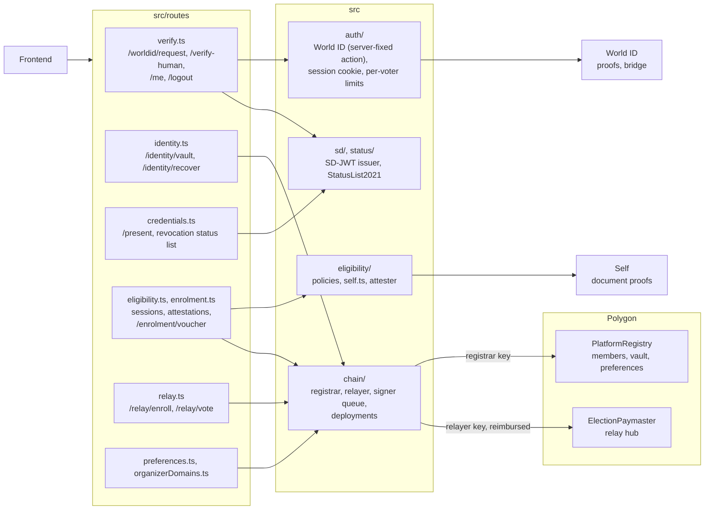

# backend/

Node.js + Express SD-JWT issuer. Opens and verifies World ID proofs and
[Self](https://self.xyz) document proofs, and issues short-lived Verifiable Credentials as
`httpOnly` cookies. Target deployment: Phala Network TEE (Intel TDX).

Sign-in establishes an ACCOUNT, not a person: Orbs were withdrawn from Spain and
World ID's document credential is not issued there, so demanding personhood at
the door would lock out the voters this is for. An election that wants it asks
at enrolment. The World ID request is opened here rather than in the browser, so
a verification survives the phone discarding the tab its owner left to approve
it; see `auth/worldIdBridge.ts`.

Eligibility is provider agnostic: `eligibility/` speaks in policies and attestations, and
`eligibility/self.ts` is the only file that knows Self exists. Age is always asked as a
predicate, so what reaches this server is "over 18", never a date of birth. The document is
read from its own chip by the Self app on the voter's phone and never leaves the device.

```bash
npm install
cp .env.example .env   # fill in ISSUER_PRIVATE_KEY, WORLD_ID_APP_ID, ...
npm test               # 160 tests
npm run dev            # http://localhost:3000
```

## How it is put together

Every route is under `/api`. What reaches the chain goes through one queue per
signing key (`chain/signer.ts`), so concurrent requests never race for a nonce.



`/relay/vote` carries no session: a ballot is authorised by its proof, and a
cookie on it would tie the ballot to the voter it is meant not to name.

See [`DEVELOPMENT.md`](DEVELOPMENT.md) for the full stack, endpoint reference, environment variables and known technical debt. See the [root README](../README.md) for project context.
