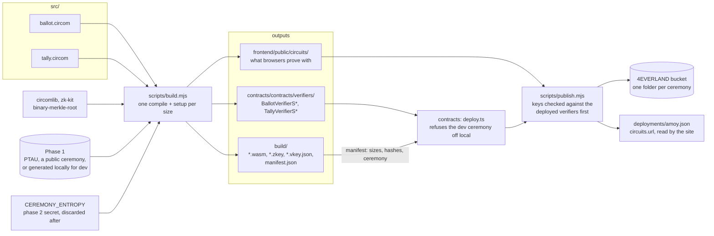

# circuits/

The two circom circuits behind every Votain ballot and result, their trusted
setup, and the Solidity verifiers they generate.

- **`src/ballot.circom`**: a ballot is an exponential ElGamal encryption of one
  option over Baby Jubjub, plus a re-randomised cancellation of the voter's
  previous ballot. The proof says the voter is on the roll, the vote is exactly
  one option, the cancellation undoes this voter's own previous ballot, and the
  tag and the epoch tag are theirs, without saying who or which ballot.
- **`src/tally.circom`**: the published counts are the decryption of the
  aggregate the election keeps, under its keys. In voiding mode it proves only
  that fewer voters than the privacy quorum took part.

```bash
npm install
npm test          # compiles the smallest size, then 8 witness tests
npm run build     # sizes 5 and 9: compile, trusted setup, verifiers
npm run build:all # adds 17, 33 and 51 slots (up to 50 options)
npm run publish:circuits -- amoy   # upload a deployment's files (circuits/.env)
npm run check:published -- amoy    # what CI runs: still there, and still right
```

On Windows the WebAssembly compiler (circom2) cannot build these circuits: put
the native circom v2.2.3 on the PATH or point `CIRCOM` at it (see the root
README).

## From source to deployment



## Publishing a deployment's files

The browser proves with the wasm and zkey of the ceremony whose verifiers are on
chain. They are too large for the repository, and CI cannot produce them without
seeing the ceremony's entropy, so the machine that ran the ceremony publishes
them: `deploy:amoy` ends with `npm run publish:circuits -- amoy`.

It refuses before sending anything unless each verification key's constants are
all in the bytecode of the verifier deployed for it. It then uploads to a folder
named after the ceremony's zkeys (a later ceremony never overwrites an earlier
one, and a rerun uploads nothing), downloads every file back from the site's
origin to prove the bucket serves it with CORS, and only then writes
`circuits.url` into both deployment manifests. The frontend takes the URL from
there, beside the contract addresses, so it cannot pair them with another
ceremony's files.

CI's `published circuits` job runs `check-published.mjs` on every push: the same
download and key check, against what the manifest records. It catches the
bucket being deleted or the files changing, which no build would notice.

With `CEREMONY_ENTROPY` unset the build uses a fixed, public entropy so every
machine produces the same development artefacts. Anyone can forge proofs
against those, which is why `deploy.ts` refuses them off the local chain before
sending a single transaction. [`docs/dev/deployment.md`](../docs/dev/deployment.md)
has the steps for a real deployment.
