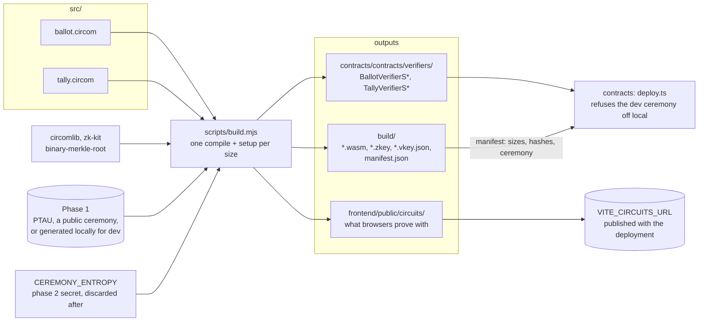

# circuits/

The two circom circuits behind every Votain ballot and result, their trusted
setup, and the Solidity verifiers they generate.

- **`src/ballot.circom`**: a ballot is an exponential ElGamal encryption of one
  option over Baby Jubjub, plus a re-randomised cancellation of the voter's
  previous ballot. The proof says the voter is on the roll, the vote is exactly
  one option, the cancellation undoes this voter's own previous ballot, and the
  tag and the epoch tag are theirs, without saying who or which ballot.
- **`src/tally.circom`**: the published counts are the decryption of the
  aggregate the election keeps, under its keys. In voiding mode it proves only
  that fewer voters than the privacy quorum took part.

```bash
npm install
npm test          # compiles the smallest size, then 8 witness tests
npm run build     # sizes 5 and 9: compile, trusted setup, verifiers
npm run build:all # adds 17, 33 and 51 slots (up to 50 options)
```

On Windows the WebAssembly compiler (circom2) cannot build these circuits: put
the native circom v2.2.3 on the PATH or point `CIRCOM` at it (see the root
README).

## From source to deployment



With `CEREMONY_ENTROPY` unset the build uses a fixed, public entropy so every
machine produces the same development artefacts. Anyone can forge proofs
against those, which is why `deploy.ts` refuses them off the local chain before
sending a single transaction. [`docs/dev/deployment.md`](../docs/dev/deployment.md)
has the steps for a real deployment.
