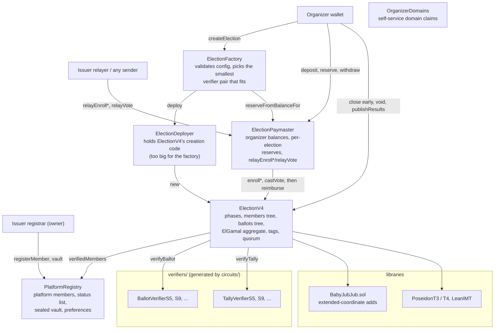

# contracts/

Solidity 0.8.37 smart contracts for Votain: elections whose ballots are exponential ElGamal ciphertexts proved by Groth16 circuits, an aggregate each election keeps itself, results published only with a proof that they decrypt it, and a gas tank and relay hub that reimburses whoever submits a voter's transaction. Voters are Semaphore V4 identities in a per-election tree; re-votes are hidden (see the root README).

NOT ERC-4337. A per-voter smart account published the link between an enrolment and the ballot that followed it, and hosted paymasters cannot fund gas per organizer. `ElectionPaymaster` says so in its own header.

```bash
npm install
npx hardhat test       # 222 passing, the E2E suite with real Groth16 proofs
npx hardhat compile
```

The E2E suite needs the circuits built first (`cd ../circuits && npm run build`).

## How the contracts fit together



See [`DEVELOPMENT.md`](DEVELOPMENT.md) for the full stack, contract reference, environment variables and known technical debt. See the [root README](../README.md) for project context.
