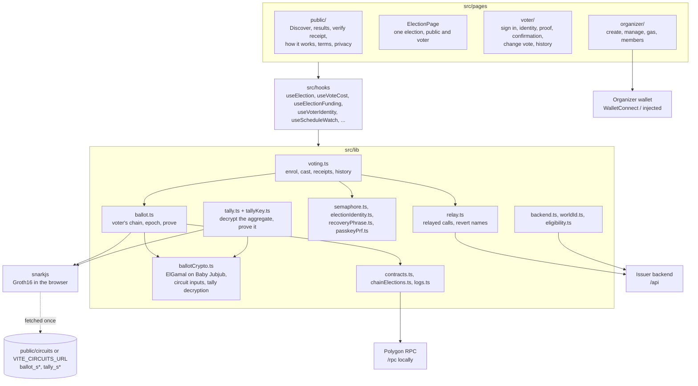

# frontend/

React 19 + Vite + Tailwind 4. Voter and organizer dApp for Votain. Semaphore V4 identities derived from a 12-word recovery phrase, sealed on the device under a WebAuthn passkey's PRF secret. Ballots are encrypted and proved in the browser. Deployed on IPFS via 4EVERLAND at `votain.app`, with CD from `main`.

```bash
npm install
npm test                # 597 tests
npm run test:e2e -- --workers=1   # Playwright smoke, every screen on three devices
cp .env.example .env   # fill in VITE_BACKEND_URL, the contract addresses, ... (World ID lives in backend/.env)
npm run dev            # http://localhost:5173
npm run build
```

## How it is put together

Screens never talk to the chain or the issuer directly: they go through hooks,
and the hooks through `src/lib/`, where each concern has one module.



`ballotCrypto.ts` has no dependencies on purpose: the tally CLI, the contract
tests and the demo seed import the same file, so the browser, the auditor and
the tests encrypt, prove and decrypt with one implementation.

See [`DEVELOPMENT.md`](DEVELOPMENT.md) for the full stack, routes, environment variables and known technical debt. See the [root README](../README.md) for project context.
