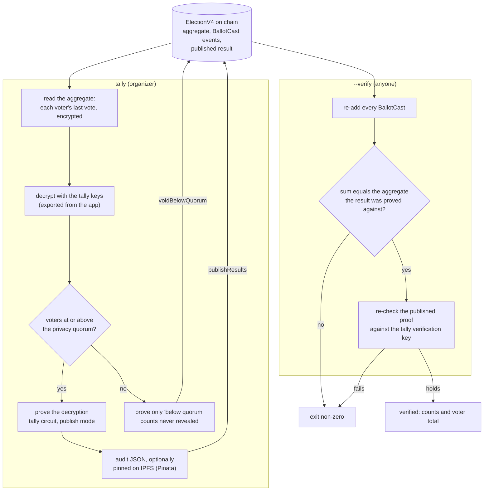

# scripts-tally/

The off-chain tally, and anyone's check of a published one. The organizer can
also tally in the app; this is the same computation for an offline machine, and
the only path that pins the result JSON to IPFS.

```bash
npm install
cp .env.example .env    # RPC_URL, and for tallying TALLY_KEY_FILE, ORGANIZER_PRIVATE_KEY
npm run tally -- <election> [--publish] [--pin]   # the organizer, holding the keys
npm run tally -- <election> --verify              # anyone, no key
```

It proves with the same tally circuit the browser uses (`CIRCUITS_DIR`, by
default the frontend's copy) and imports the browser's own
`frontend/src/lib/ballotCrypto.ts`, so the two cannot disagree on the
arithmetic.

## What each mode does



The contract already refuses a result whose proof does not verify; `--verify`
repeats the check independently of the on-chain verifier, from the chain data
alone.
